# React-i18nextを利用したi18nの実践例

---

## 概要

図1 概要

* 複数の画面で共通で使用するメッセージはnpm packageにして再利用できるようにする。
* 利用者側は、共通のメッセージと固有のメッセージ両方を利用できる。
* 共通のメッセージは複数用意することが可能(名前空間で使い分ける)。

---

## 前提

### npm package registry

今回はGitHubを使用していますが、[Verdaccio](https://verdaccio.org)や[GitLab](https://about.gitlab.com)などnpm package registryに対応したものを適宜利用してください。
本資料ではこれらのpackage registryの設定方法については省略します。

### npm

npmのインストールについては解説を省略します。

---

## 共通パッケージの作成

共通メッセージを格納するパッケージを作成します。ここで作成したパッケージは、任意のアプリケーションから、npm installすることで利用可能になります。

---

### npmパッケージの作成

適当なディレクトリ(今回はreact-i18n-common)を作成して、その中でnpm initを実行します。

    $ mkdir react-i18n-common
    $ cd react-i18n-common
    $ npm init

質問に答えていくとpackage.jsonが作成されます。なおGitHub npm package registryを使用する場合は、package.jsonのパッケージに、以下のように<user>のところにGitHubのユーザ名を指定してください。これを忘れるとこの後のnpm publishに失敗しますので注意してください。

      "name": "@<user>/react-i18n-common",

---

### メッセージファイルの作成

共通メッセージの日本語版(ja.json)と英語版(en.json)を作成します(パッケージのルートディレクトリ。package.jsonがある場所に作成します)。

    --- ja.json ---
    {
        "HelloWorld": "こんにちは世界!"
    }

    --- en.json ---
    {
        "HelloWorld": "Hello, World!"
    }

---

### npm package registryのアクセス先設定

.npmrcにアクセス設定をしてください。今回はGitHubの方法を記載しますが適宜ご利用のnpm package registryのやり方に読み替えてください。このファイルもパッケージのルートディレクトリに配置します(ownerにはGitHubのアカウント名を指定します)。

    --- .npmrc ---
    registry=https://npm.pkg.github.com/<owner>

### アクセス・トークンの設定

[個人アクセストークンの作成](https://docs.github.com/ja/authentication/keeping-your-account-and-data-secure/creating-a-personal-access-token)を参照してアクセストークンを作成します。scopeにはrepoとwrite:packageを指定します。

---

### アクセス・トークンを.npmrcに保管

以下のコマンドでアクセス・トークンを.npmrcに保管します。XXXのところにはアクセス・トークンを設定します。

    echo "//npm.pkg.github.com/:_authToken=XXX" >> .npmrc

結果として.npmrcの中身は以下の2行になります。

    registry=https://npm.pkg.github.com/XXX
    //npm.pkg.github.com/:_authToken=XXX

---

### GitHub npm package registryへのpublish

まずログインを実行します。

    $ npm login --registry=https://npm.pkg.github.com

この時、UsernameにはGitHubのユーザ名を、Passwordにはアクセス・トークンを、Emailには、GitHubに登録しているemailを指定します。
ログインできたら。以下のコマンドでpublishします。

    $ npm publish

publishが成功すると、GitHubのPackagesの中に表示されるようになります。

---

## 利用者側のパッケージの作成

次に利用者側のパッケージを作成します。ここではCreate react appを使って作成したサンプルをそのまま使います。なおCreate react appを使ったReactのサンプル作成についての解説は省略します。

---

