# React-i18nextを利用したi18nの実践例

---

## 概要

図1 概要

* 複数の画面で共通で使用するメッセージはnpm packageにして再利用できるようにする。
* 利用者側は、共通のメッセージと固有のメッセージの両方を利用できる。
* 共通のメッセージは複数用意することが可能(名前空間で使い分ける)。

---

## 前提

### npm package registry

今回はGitHubを使用していますが、[Verdaccio](https://verdaccio.org)や[GitLab](https://about.gitlab.com)などnpm package registryに対応したものを適宜利用してください。
本資料ではこれらのpackage registryの設定方法については省略します。

### npm

npmのインストールについては解説を省略します。

---

## 共通パッケージの作成

共通メッセージを格納するパッケージを作成します。ここで作成したパッケージは、任意のアプリケーションから、npm installすることで利用可能になります。

---

### npmパッケージの作成

適当なディレクトリ(今回はreact-i18n-common)を作成して、その中でnpm initを実行します。

    $ mkdir react-i18n-common
    $ cd react-i18n-common
    $ npm init

質問に答えていくとpackage.jsonが作成されます。なおGitHub npm package registryを使用する場合は、package.jsonのパッケージに、以下のように[user]のところにGitHubのユーザ名を指定してください。これを忘れるとこの後のnpm publishに失敗しますので注意してください。

      "name": "@[user]>/react-i18n-common",

---

### メッセージファイルの作成

共通メッセージの日本語版(ja.json)と英語版(en.json)を作成します(パッケージのルートディレクトリ。package.jsonがある場所に作成します)。

    --- ja.json ---
    {
        "HelloWorld": "こんにちは世界!"
    }

    --- en.json ---
    {
        "HelloWorld": "Hello, World!"
    }

---

### npm package registryのアクセス先設定

.npmrcにアクセス設定をしてください。今回はGitHubの方法を記載しますが適宜ご利用のnpm package registryのやり方に読み替えてください。このファイルもパッケージのルートディレクトリに配置します(ownerにはGitHubのアカウント名を指定します)。

    --- .npmrc ---
    registry=https://npm.pkg.github.com/[owner]

---

### アクセス・トークンの設定

[個人アクセストークンの作成](https://docs.github.com/ja/authentication/keeping-your-account-and-data-secure/creating-a-personal-access-token)を参照してアクセストークンを作成します。scopeにはrepoとwrite:packageを指定します。

---

### アクセス・トークンを.npmrcに保管

以下のコマンドでアクセス・トークンを.npmrcに保管します。XXXのところにはアクセス・トークンを設定します。

    echo "//npm.pkg.github.com/:_authToken=XXX" >> .npmrc

結果として.npmrcの中身は以下の2行になります。

    registry=https://npm.pkg.github.com/XXX
    //npm.pkg.github.com/:_authToken=XXX

---

### GitHub npm package registryへのpublish

まずログインを実行します。

    $ npm login --registry=https://npm.pkg.github.com

この時、UsernameにはGitHubのユーザ名を、Passwordにはアクセス・トークンを、Emailには、GitHubに登録しているemailを指定します。
ログインできたら。以下のコマンドでpublishします。

    $ npm publish

publishが成功すると、GitHubのPackagesの中に表示されるようになります。

---

## 利用者側のパッケージの作成

次に利用者側のパッケージを作成します。ここではCreate react appを使って作成したサンプルをそのまま使います。なおCreate react appを使ったReactのサンプル作成についての解説は省略します。

---

### .npmrcの設定

共通メッセージ・パッケージの作成の時に用意した利用者側にコピーします。

---

### 共通メッセージのインストール

以下のコマンドで作成しておいた共通メッセージをインストールします。ここでXXの部分はGitHubのユーザ名ですが、npm installで指定するパッケージ名は、使用するnpm package registryによって違うので、お使いのものに合わせてください。

    $ npm install react-i18next i18next
    $ npm install @XXX/react-i18n-common@1.0.0

---

### 共通メッセージを使用する

index.jsがある場所にi18n.jsを作ります。XXXのところはGitHubのユーザ名です。

    import i18n from "i18next";
    import { initReactI18next } from "react-i18next";
    
    import enCommonMsg from '@XXX/react-i18n-common/en.json';
    import jaCommonMsg from '@XXX/react-i18n-common/ja.json';
    
    const resources = {
      ja: {
        common: jaCommonMsg
      },
      en: {
        common: enCommonMsg
      }
    };
...    

---

### 共通メッセージを使用する(続き)

    i18n
      .use(initReactI18next)
      .init({
        resources,
        lng: 'ja',
        fallbackLng: 'ja'
      });
    
    export default i18n;

---

### App.jsで共通メッセージを使用する

次にApp.jsの中で共通メッセージを使用してみます。まず。i18nのimportを追加します。

    import logo from './logo.svg';
    import './App.css';
    import React, { useState, useEffect } from 'react'; // 追加
    import { useTranslation } from 'react-i18next'; // 追加
    import './i18n';              // 追加

---

### App.jsで共通メッセージを使用する(続き)

ここでは言語の切り替え機能も追加しています。

    function App() {
      const { t, i18n } = useTranslation(['common']);
      const [lang, setLang] = useState('ja');
    
      useEffect(() => {
        i18n.changeLanguage(lang);
      }, [lang, i18n]);

---

### App.jsで共通メッセージを使用する(続き)

      return (
        

    ...
            </a>
            {t('HelloWorld')}
            <button onClick={() => setLang(lang === 'en' ? 'ja' : 'en')}>
              Change Lang
            </button>
        </header>
        

メッセージは{t('メッセージキー')}で表示できます。またここでは言語切り替えのボタンを追加しています。

---

## アプリケーション固有メッセージを使用する

共通のメッセージ以外に、アプリケーション固有メッセージを定義し、共通メッセージと使い分ける方法を見ていきます。

---

### 固有メッセージに定義

i18n.jsと同じ場所に、固有メッセージを定義したen.jsonとja.jsonを用意します。

    --- ja.json ---
    {
        "Name": "名前"
    }

    --- en.json ---
    {
        "Name": "Name"
    }

---

### i18n.jsに固有メッセージ定義を追加する

    import enCommonMsg from '@ruimo/react-i18n-common/en.json';
    import jaCommonMsg from '@ruimo/react-i18n-common/ja.json';
    
    import enMsg from './en.json';  // 追加
    import jaMsg from './ja.json';  // 追加
    ...
    const resources = {
      ja: {
          common: jaCommonMsg,
          app: jaMsg,  // 追加
      },
      en: {
          common: enCommonMsg,
          app: enMsg  // 追加
      }
    };

---

### App.jsで固有メッセージを取り込む

    function App() {
        const { t, i18n } = useTranslation(['common', 'app']); // 'app'を追加
        const [lang, setLang] = useState('ja');

    ...

      
{t('HelloWorld')}

      
{t('Name', { ns: 'app'})}
 // 固有メッセージは名前空間を指定
---

